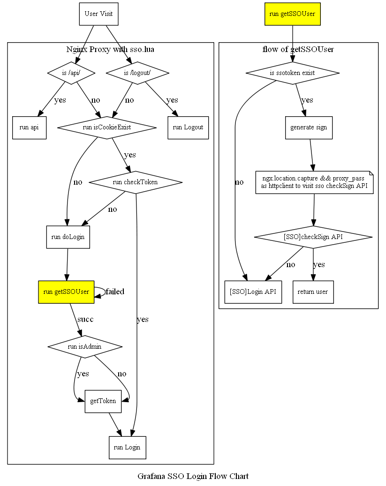

# Nginx+Lua实现Grafana集成SSO

## 基本思路
Grafana开auth.proxy, Nginx+Lua控制cookie及X-WEBAUTH-USER的值 (Enable auth.proxy in Grafana, Then use Nginx+Lua to control cookie and value of X-WEBAUTH-USER).

架构图



## 环境配置

* Download and install [LuaJIT](http://luajit.org/download/LuaJIT-2.0.4.tar.gz)，
* Install Tengine 2.2.1 with  configure option `--with-http_lua_module --with-ld-opt="-Wl,-rpath,$LUAJIT_LIB"`
* Download and compile [lua-cjson](http://www.kyne.com.au/~mark/software/download/lua-cjson-2.1.0.tar.gz), then copy cjson.so to lib dir. Such as `/usr/lib64/lua/5.1/`

## Nginx配置

### Main Configuration

```
upstream grafana {
	server 127.0.0.1:3000;
}

server {
	listen      10.0.0.11:80;
	server_name  grafana.xxx.cn;
	access_log logs/monitor.proxy.log main;

	location @client{
		proxy_pass  http://grafana;
	}

	location ^~ /proxy/ {
	    internal;   #指定规则为internal规则，防止外部请求命中此规则
	    rewrite '^/proxy/(http?)/([^/]+)/(\d+)/(.*)'  /$4 break;
	    proxy_pass $1://$2:$3;
	}
	
	location / {
		access_by_lua_file 'conf.d/grafana_sso/sso.lua';
	}
}
```

### Access With Out SSO
某种情况下可能不想挑转到sso去认证，比如某个公共的本地账号。这时可以通过Nginx配置绕过SSO认证(Sometimes we may want to login with out SSO, such as a local grafana account for public use. For this situation, we can use Nginx to bypass SSO)

```
server {
	listen 10.0.0.11:3030;
	server_name grafana.xxx.cn;
	access_log logs/grafana-nosso.log main;

	location / {
		proxy_pass http://127.0.0.1:3000;
	}

	location @client {
		proxy_pass http://127.0.0.1:3000;
	}
	
	# api访问需要被过滤，否则在开启auth.proxy的情况下任意用户都可以操作API
	# filter api access. if not , everyone can access api when auth.proxy enabled	
	location /api/ {
		access_by_lua_file 'conf.d/grafana_sso/sso.lua';
	}
}
```

## Full Code

```
local secretkey = 'your secretkey'
local timeStr = os.date("%x", os.time())

function getSSOUser()
	local sso = 'https://sso/login.php'
	local mysite = 'http://monitor'
	local login_url = sso .. '?next=' .. mysite

	local request_method = ngx.var.request_method
	if "GET" == request_method then
		args = ngx.req.get_uri_args()
	elseif "POST" == request_method then
		ngx.exit(405)
	end

	-- get m_tk
	local m_tk = args['m_tk']
	if m_tk == nil then
		ngx.redirect(login_url)
	end
	
	-- check user token
	local time = os.time()
	local check_url = 'http/sso/8080/check.php'  -- format used by ngx.location.capture && proxy_pass(a httpclient simulation)
	local key = 'your local key'
	local cjson = require("cjson")
	
	-- Sign algorithm. (base on your SSO)
	local sign = ngx.md5(xxx)
	local checkSign = xxx
	
	--[[
	location ^~ /proxy/ {
	    internal;   //指定规则为internal规则，防止外部请求命中此规则
	    rewrite ^/proxy/(http?)/([^/]+)/(\d+)/(.*)     /$4 break;
	    proxy_pass      $1://$2:$3;
	}
	--]]
	checkUrl = '/proxy/' .. check_url .. '?' .. checkSign
	
	-- simulate a httpclient use ngx.location.capture && proxy_pass
	local res = ngx.location.capture(checkUrl, {
		method = ngx.HTTP_GET,
	})

	if res.body then
		obj = cjson.decode(res.body)
		code = obj['respond']['code']
		--ngx.say(code)
		if code ~= '0' then
			--ngx.say(res.body)
			ngx.exit(401)
		end

		objects = obj['results']
		arr = ngx.decode_args(objects)
		local user = arr['u']
		return user
	else
		ngx.redirect(login_url)
	end
end


function getToken(user)
	local ctoken = ngx.md5("user:" .. user .. "&key:" .. secretkey .. timeStr)
	return ctoken
end

function checkToken()
	local user = ngx.var.cookie_x_webauth_user
	local token = ngx.var.cookie_x_webauth_token
	local ctoken = getToken(user)
	if ctoken == token then
		return true
	else
		return false
	end
end

function isCookieExist()
	local user = ngx.var.cookie_x_webauth_user
	local token = ngx.var.cookie_x_webauth_token
	if user ~= nil and token ~= nil then
		return user
	else
		return false
	end
end
	
function Login(user)
	--[[
	# grafana 配置文件中修改配置项 http_addr 绑定 127.0.0.1，拒绝外部访问，否则任何人都可以通过auth.proxy登录任意账号
	# http_addr must bind to 127.0.0.1, otherwise everybody can login as any account(include admin) with auth.proxy
	# The ip address to bind to, empty will bind to all interfaces
	http_addr = 127.0.0.1

	nginx 添加如下配置 (add Nginx Configuration)
	location @client {
		proxy_pass http://127.0.0.1:3000;
	}
	--]]
	ngx.req.set_header("X-WEBAUTH-USER", user)
	ngx.exec("@client")
end

-- 管理员用户
function isAdmin(user)
	if user == "xxx" then
		return "admin"
	else
		return user
	end
end

function doLogin()
	local user = getSSOUser()
	local user = isAdmin(user)
	local x_token = getToken(user)
	ngx.header['Set-Cookie'] = {'x_webauth_user =' ..  user , 'x_webauth_token = ' .. x_token}
	Login(user)
end

-- 退出	
function Logout()
	if ngx.re.match(ngx.var.request_uri, "logout")  then
		ngx.header['Set-Cookie'] = {'x_webauth_user = '}
	end
end

-- api do not use auth.proxy
function api()
	if ngx.re.match(ngx.var.request_uri, "/api/") then
		ngx.req.clear_header("X-WEBAUTH-USER")
		ngx.exec("@client")
	end
end

api()
Logout()

local x_user = isCookieExist()
if not x_user then
	doLogin()
else
	if checkToken() then
		Login(x_user)
	else
		doLogin()
		--ngx.exit(401)
	end
end

```

## 参考资料
```
1. https://www.stavros.io/posts/writing-an-nginx-authentication-module-in-lua/
2. https://blog.raintank.io/authproxy-howto-use-external-authentication-handlers-with-grafana/
3. http://blog.csdn.net/langeldep/article/details/8629906
4. http://www.cnblogs.com/kyrios/p/ngx_lua-httpclient-using-capture-and-proxy.html
```