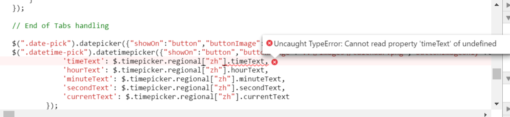

# iTop 2.2.1 升级到2.3.1

## 升级过程中断
数据库升级之后就停了，chrome审查元素可以看到后续步骤需要[sso认证](http://www.annhe.net/article-3553.html)。

原因：

一开始把2.3.1放在2.2.1的子目录下，用2.2.1的域名加 `/web` 子目录来访问2.3.1。sso扩展的代码片段如下：

```
if(preg_match('/^\/toolkit\/|^\/webservices\/|^\/setup\//i',$_SERVER['REQUEST_URI']))
```
匹配已 `/setup` 开头的URI，而子目录下的URI为 `/web/setup`，所以仍然需要sso认证。

因此，把2.2.1目录改个名字，2.3.1使用2.2.1的路径即可解决问题。


## 中文界面不正常
这是一个bug，jQuery里中文的代码是 zh-CN，iTop按照语言代码(ZH CN)截取前两位取小写，导致jQuery报错：



临时解决方案，编辑`application/itopwebpage.class.inc.php`，找到`$sJSLangShort`的定义，添加如下代码：

```
				$sJSLangShort = json_encode(strtolower(substr(Dict::GetUserLanguage(), 0, 2)));
                // 中文bug
                if($sJSLangShort == '"zh"')
                {
                        $sJSLangShort = '"zh-CN"';
                }
```

## Portal里my Profile页面报错
```
Unknown attribute location_id from class Person.
```

原因是[自定义Person类](https://github.com/annProg/itop-extensions/blob/master/le-config-mgmt/datamodel.le-config-mgmt.xml)的时候把location_id删除了。因此需要修改itop-tickets中的module_design关于location_id的定义：

```
<module_designs>
		<!--删除location_id-->
		<module_design id="itop-portal" xsi:type="portal">
			<bricks>
				<brick id="user-profile" xsi:type="Combodo\iTop\Portal\Brick\UserProfileBrick">
					<form>
						<twig _delta="redefine">
							<!-- data-field-id attribute must be an attribute code of the class -->
							<!-- data-field-flags attribute contains flags among read_only/hidden/mandatory/must_prompt/must_chan     ge -->
							<div class="form_field" data-field-id="first_name" data-field-flags="read_only">
							</div>
							<div class="form_field" data-field-id="name" data-field-flags="read_only">
							</div>
							<div class="form_field" data-field-id="org_id" data-field-flags="read_only">
							</div>
							<div class="form_field" data-field-id="email" data-field-flags="read_only">
							</div>
							<div class="form_field" data-field-id="phone">
							</div>
							<div class="form_field" data-field-id="function">
							</div>
							<div class="form_field" data-field-id="manager_id" data-field-flags="read_only">
							</div>
						</twig>
					</form>
				</brick>
			</bricks>
		</module_design>
	</module_designs>
```

详情参考github提交 [9058dd6](https://github.com/annProg/itop-extensions/commit/9058dd6e7e2c2d36e821cc5fef397ae297775cb6)

## 中文PDF问题

参考：http://www.annhe.net/article-3567.html