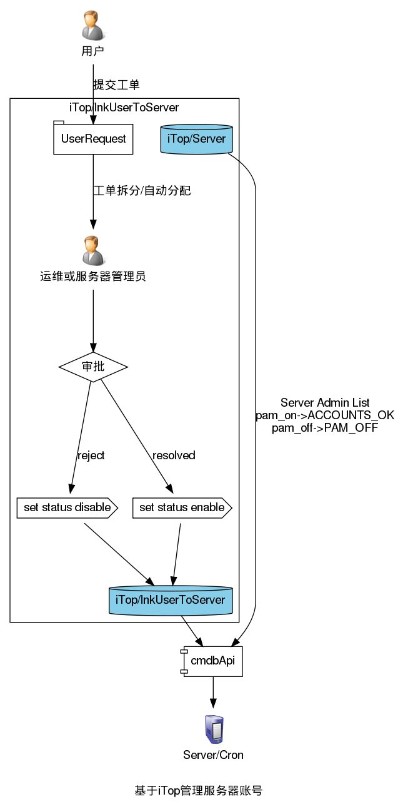

# 基于iTop及pam_listfile的服务器账号管理方案

使用iTop CMDB实现服务器账号的存储及用户申请及审核界面，使用cmdbApi提供一个面向服务器的查询接口，服务器上一个脚本通过定时任务（或者ansible等工具触发）的方式查询本机账号信息，更新pam_listfile.so配置文件及sudo配置文件。

## 逻辑结构



## iTop/lnkUserToServer及工单
### lnkUserToServer属性表：

  属性编码                        标签            类别                                                       起源              描述                                                                                                      允许值                                    更多信息
  ------------------------------- --------------- ---------------------------------------------------------- ----------------- --------------------------------------------------------------------------------------------------------- ----------------------------------------- ----------------------------------------------------------------------
  user\_id                        用户账号        外部键 (外部键值(或者外来的))                              lnkUserToServer   [用户 (User)](schema.php?operation=details_class&class=User&c[menu]=DataModelMenu "用户登录名")的外部键   Filter: SELECT User                       列: *user\_id: INT(11)*, 缺省: "0", 不允许空
  user\_name                      登录名          外部字段 (字段映射到一个外部键)                            lnkUserToServer   用户标识字符串                                                                                                                                       
  user\_contactid                 联系人 (个人)   外部字段 (字段映射到一个外部键)                            lnkUserToServer   来自业务数据的个人明细信息                                                                                                                           
  user\_email                     Email           外部字段 (字段映射到一个外部键)                            lnkUserToServer   对应联系人的Email                                                                                                                                    
  user\_status                    Status          外部字段 (字段映射到一个外部键)                            lnkUserToServer   Whether the user account is enabled or disabled.                                                                                                     
  status                          账号状态        枚举 (预定义的字母数字字符串列表)                          lnkUserToServer                                                                                                             disabled =\> 未审核, enabled =\> 已审核   列: *status: ENUM('disabled','enabled')*, 缺省: "disabled", 不允许空
  server\_id                      服务器          外部键 (外部键值(或者外来的))                              lnkUserToServer   [服务器 (Server)](schema.php?operation=details_class&class=Server&c[menu]=DataModelMenu)的外部键          Filter: SELECT Server                     列: *server\_id: INT(11)*, 缺省: "0", 不允许空
  server\_ip                      IP地址          外部字段 (字段映射到一个外部键)                            lnkUserToServer                                                                                                                                                        
  sudo                            Sudo权限        枚举 (预定义的字母数字字符串列表)                          lnkUserToServer                                                                                                             no =\> no, yes =\> yes                    列: *sudo: ENUM('no','yes')*, 缺省: "no", 允许空
  expiration                      过期时间        日期/时间 (日期和时间 (年-月-日 hh:mm:ss))                 lnkUserToServer                                                                                                                                                       列: *expiration: DATETIME*, 缺省: "", 允许空
  friendlyname                    全名            好记的名称 (属性自动创建;经过几个属性计算出的好记的名称)   lnkUserToServer   全名                                                                                                                                                 
  user\_id\_friendlyname          用户账号        好记的名称 (属性自动创建;经过几个属性计算出的好记的名称)   User                                                                                                                                                                   
  user\_id\_finalclass\_recall    帐户类别        外部字段 (字段映射到一个外部键)                            User                                                                                                                                                                   
  user\_contactid\_friendlyname   联系人 (个人)   外部字段 (字段映射到一个外部键)                            User              来自业务数据的个人明细信息                                                                                                                           
  server\_id\_friendlyname        服务器          好记的名称 (属性自动创建;经过几个属性计算出的好记的名称)   Server                                                                                                                                                                 

### Server属性表
新增属性use_pam

  属性编码                        标签            类别                                                       起源              描述                                                                                                      允许值                                    更多信息
  ------------------------------- --------------- ---------------------------------------------------------- ----------------- --------------------------------------------------------------------------------------------------------- ----------------------------------------- ----------------------------------------------------------------------
  use\_pam	                      PAM验证	      枚举 (预定义的字母数字字符串列表)	                         Server	 	                                                                                                                 no => no, yes => yes	                   列: use_pam: ENUM('no','yes'), 缺省: "no", 允许空

### 工单实现
[custom-pages/server_accounts.php](https://github.com/annProg/itop-extensions/tree/master/custom-pages)

## cmdbApi实现
[cmdbApi/web/acdounts.php](https://github.com/annProg/cmdbApi/blob/master/web/accounts.php)

## 服务器cron脚本实例

```
#!/bin/bash

CMDBAPI="http://cmdb.xxx.cn/api/accounts.php"
CONF="/etc/cloud_sshduser"
PAM_SSHD="/etc/pam.d/sshd"
SUDO="/etc/sudoers.d/cmdb"
PAM_BACKUP="/etc/pam.d/sshd.bak"
IPADDR=`ip add |grep -E "10\." |grep -v "/32" |head -n 1 |awk '{print $2}' |awk -F'/' '{print $1}'`

# 接口返回说明
# PAM_OFF#| : PAM关闭，应恢复/etc/pam.d/sshd文件
# ACCOUNTS_OK#| : PAM开启
# Permission Deny : 无权限查询，直接退出
# ERROR: 错误，直接退出
# NOT FOUND: 未找到 直接退出

function pam_off()
{
	if [ ! -f $PAM_BACKUP ];then
		sed -i "#$CONF#d" $PAM_SSHD
	else	
		cp $PAM_BACKUP $PAM_SSHD
	fi
}

function pam_on()
{
	[ ! -f $PAM_BACKUP ] && cp $PAM_SSHD $PAM_BACKUP
	cat >$PAM_SSHD <<EOF
#%PAM-1.0
auth	   required	pam_sepermit.so
auth       include      password-auth
account    required     pam_nologin.so
#account    required    pam_access.so
account    requisite    pam_listfile.so item=user sense=allow file=$CONF onerr=succeed
account    include      password-auth
password   include      password-auth
# pam_selinux.so close should be the first session rule
session    required     pam_selinux.so close
session    required     pam_loginuid.so
# pam_selinux.so open should only be followed by sessions to be executed in the user context
session    required     pam_selinux.so open env_params
session    optional     pam_keyinit.so force revoke
session    include      password-auth
EOF

	cat > $CONF <<EOF
root
user1
user2
EOF

	cat > $SUDO <<EOF
user1	ALL=(ALL) 	NOPASSWD: ALL
user2	ALL=(ALL) 	NOPASSWD: ALL
EOF
	
for u in `echo $1 | tr ',' ' '`;do
	echo "$u" >> $CONF
	echo "$u ALL=(ALL) NOPASSWD: ALL" >> $SUDO
done
}

userlist=`curl --connect-timeout 3 -s "$CMDBAPI?ip=$IPADDR" |head -n 1`

stats=`echo "$userlist" |cut -f1 -d'#'`
users=`echo "$userlist" |cut -f2 -d'#' |cut -f1 -d'|'`
sudoers=`echo "$userlist" |cut -f2 -d'#' |cut -f2 -d'|'`

echo $userlist
case $stats in
	"ACCOUNTS_OK") pam_on "$users";;
	"PAM_OFF") pam_off;;
	"ERROR") exit 1;;
	"NOT FOUND") exit 1;;
	"Permission denied") exit 1;;
	*) echo "UNKOWN ERROR";exit 1;;
esac
```

## 问题

服务器cron脚本目前只维护授权登录账号列表，并不负责账号的添加/删除及密码的管理。
