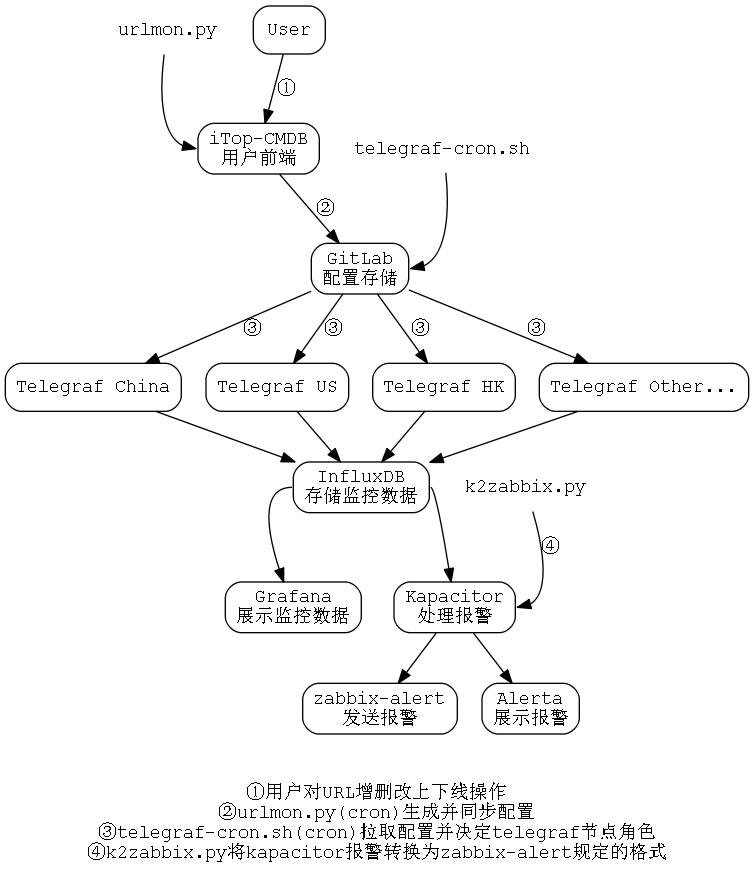

# 基于Telegraf和InfluxDB的url监控方案

## 概述
url监控功能需求

- 面向用户提供一个表单，提交要监控的url
- 支持GET、POST以及Header参数
- 支持多种匹配规则（状态码、匹配字符串、响应时间）
- 用户定义监控频率

[基于zabbix的web scenarios实现过一种url监控](http://www.annhe.net/article-3580.html)，优点是zabbix的触发器功能很好用，缺点是：

- 和其他系统的结合有些不够方便灵活
- item名称长度有限制，不能显示完整的url
- 无法记录请求失败时的网页内容（只告诉你匹配失败了）
- 多节点监控不好做

目前使用Telegraf+InfluxDB+Kapacitor的方案。influxdb支持push任意tags和fields(指标)，因此可以很方便的记录url，url归属的app，失败时的返回数据，甚至阈值匹配结果。多节点支持也比较方便，直接部署多个Telegraf节点就可以了，需要解决的就是配置文件分发的问题，即让Telegraf知道哪些配置文件是需要监控的。

整体架构图如下



## 监控核心
核心监控程序是Telegraf的一个[url_monitor](https://github.com/annProg/url_monitor)插件，根据Telegraf官方插件`http_response`修改而来，配置文件样例：

```
[global_tags]
  monitor_node = "China"

部分省略...
  
# HTTP/HTTPS request given an address a method and a timeout
[[inputs.url_monitor]]
  ## App Name
  app = "monitor"
  ## CMDB ID
  cmdbid = "1701"
  address = "http://www.baidu.com"
  response_timeout = "5s"
  method = "GET"
  ## Require String 正则表达式用单引号避免转义,如果需要包含单引号，请使用'''。如果字符串末尾有单引号'，需要换行
  require_str = '''
baidu.com
'''
  require_code = '20\d'
  failed_count = 3
  failed_timeout = 0.5
  ## Whether to follow redirects from the server (defaults to false)
  follow_redirects = true
  ## GET params
  params = '''
ak=xxx&sign=xxx
'''
  ## Optional HTTP Request Body
  # body = '''
  # {'fake':'data'}
  # '''

  ## HTTP Request Headers (all values must be strings)
  ## 表格名下，直到下一个表格名或文件尾，均为当前表格的内容 所以Headers应该放在最后
  # [inputs.url_monitor.headers]
  #   Host = "github.com"
```

Measurements & Fields:

- url_monitor
- response_time (float, seconds)
- http_code (int) #The code received
- data_match
- time_match
- code_match
- require_code
- require_str
- require_time

注意三个形如 `*_match` 的fields，此处是直接通过url_monitor插件来检查url是否匹配 `require_*`定义的内容，匹配则为1，不匹配为0，这样做的目的是报警脚本方便处理。

Tags:

- app
- cmdbid
- url
- method

输出样例:

```
# ./telegraf -config url.conf -test
* Plugin: url_monitor, Collection 1
> url_monitor,app=monitor,cmdbid=1701,host=HADOOP-215,method=GET,url=http://www.baidu.com code_match=1i,data_match=1i,failed_threshold="3",http_code=200i,require_code="20\\d",require_str="baidu.com",require_time="0.0005",response_time=0.023157402,time_match=0i 1473150864000000000
```

生产环境使用InfluxDB存储Telegraf监控数据

## 多节点监控
[telegraf-url-client](https://github.com/annProg/telegraf-url-client)，此项目提供初始化监控节点的脚本：

```
初始化一个节点，名称为China
./init.sh China
```

启动Telegraf

```
$node为节点变量，根据不同节点，-config-directory为不同的目录
telegraf -config $rootdir/url.conf -config-directory $rootdir/$urls_dir/$node -pidfile $rootdir/telegraf.pid
```

`telegraf-url-client`中包含一个脚本`telegraf-cron.sh`，`init.sh`脚本会自动配置cron，该脚本会定期从Gitlab pull最新配置，并检查自己节点的配置是否有更新，如有，则reload Telegraf。

## Gitlab存储监控配置
根据上一节，gitlab存储配置的时候结构：

```
├── telegraf-url
│   ├── China
│   ├── HongKong
│   └── UnitedStates
```
即以节点名称作为目录名称。

以此基础编写[urlmon.py](https://github.com/annProg/itop-tools/blob/master/urlmon.py)脚本，设置定时任务，监控iTop中Url类的更新，转换成Telegraf配置文件，然后提交到Gitlab。

## 报警
使用Kapacitor，参考[http://www.annhe.net/article-3580.html](http://www.annhe.net/article-3580.html)

tickscript样例

```
var win = 3m
var origin = stream
    |from()
        .database('telegraf')
        .retentionPolicy('default')
        .measurement('url_monitor')
        .groupBy('monitor_node','app','url', 'cmdbid')
    |window()
        .period(win)
        .every(10s)

var code_match = origin
    |mean('code_match')

var http_code = origin
    |last('http_code')

var require_code = origin
    |last('require_code')

code_match
    |join(http_code, require_code)
        .as('code_match', 'http_code', 'require_code')
        .tolerance(5s)

    |alert()
        .id('HTTP_CODE:{{ index .Tags "cmdbid" }}.{{ index .Tags "url" }}')
        .message('')
        .crit(lambda: "code_match.mean" < 0.4)
        .critReset(lambda: "code_match.mean" == 1)
        .stateChangesOnly(30m)
        .log('/tmp/alerts.log')
        .exec('/opt/kapacitor/tools/k2zabbix.py', 'product')
```

由第一小节(监控核心)可知，每个url都有一个叫`app`的tag，app的联系人存储在CMDB中，[zabbix-alert](https://github.com/annProg/zabbix-alert)是针对zabbix写的一个报警脚本，支持通过特定字段从CMDB取联系人，以及简单的报警合并。[k2zabbix.py](https://github.com/annProg/zabbix-alert/tree/master/tools)将Kapacitor产生的报警转换成`zabbix-alert`能够处理的格式，`zabbix-alert`通过`app`标签来确定报警该发给谁，并且会合并某段时间（比如1分钟内）某`app`所有报警的`url`，防止报警风暴。


### Alerta展示报警
```
	|alert()
		部分省略...
        .alerta()
            .resource('{{ index .Tags "cmdbid" }}.{{ index .Tags "monitor_node" }}:{{ index .Tags "app" }}')
            .event('状态码异常: {{ index .Tags "url" }}')
            .environment('Production')
            .group('{{ index .Tags "cmdbid" }}.{{ index .Tags "monitor_node" }}:{{ index .Tags "app" }}')
            .value('{{ index .Fields "http_code.last" }}')
```

## 用户界面
在iTop中定义了一个Url类作为用户操作url监控界面，并做了权限限定，用户能对自己名下`app`的url做增、删（下线）、改、上线、暂停监控操作。


## 展示
使用Grafana，并且在iTop的Url类中新增一个tab，将Grafana页面嵌入iTop。


```
#可用率统计
SELECT sum("code_match")/count("http_code") FROM "url_monitor" WHERE "app" =~ /^$app$/ AND "monitor_node" =~ /^$monit_node$/ AND "url" =~ /^$url$/ AND $timeFilter GROUP BY "app", "monitor_node"
SELECT sum("data_match")/count("http_code") FROM "url_monitor" WHERE "app" =~ /^$app$/ AND "monitor_node" =~ /^$monit_node$/ AND "url" =~ /^$url$/ AND $timeFilter GROUP BY "app", "monitor_node"
SELECT sum("time_match")/count("http_code") FROM "url_monitor" WHERE "app" =~ /^$app$/ AND "monitor_node" =~ /^$monit_node$/ AND "url" =~ /^$url$/ AND $timeFilter GROUP BY "app", "monitor_node"

# cq计算小时可用率，天可用率，周可用率
name: telegraf
--------------
name		query
url_avail_h	CREATE CONTINUOUS QUERY url_avail_h ON telegraf BEGIN SELECT sum(code_match) / count(http_code) AS avail_code, sum(data_match) / count(http_code) AS avail_data, sum(time_match) / count(http_code) AS avail_time INTO telegraf.trend365.url_avail_h FROM telegraf."default".url_monitor GROUP BY time(1h), monitor_node, app, url END
url_avail_d	CREATE CONTINUOUS QUERY url_avail_d ON telegraf BEGIN SELECT sum(code_match) / count(http_code) AS avail_code, sum(data_match) / count(http_code) AS avail_data, sum(time_match) / count(http_code) AS avail_time INTO telegraf.trend365.url_avail_d FROM telegraf."default".url_monitor GROUP BY time(1d), monitor_node, app, url END
url_avail_w	CREATE CONTINUOUS QUERY url_avail_w ON telegraf BEGIN SELECT sum(code_match) / count(http_code) AS avail_code, sum(data_match) / count(http_code) AS avail_data, sum(time_match) / count(http_code) AS avail_time INTO telegraf.trend365.url_avail_w FROM telegraf."default".url_monitor GROUP BY time(1w), monitor_node, app, url END
```

## 存在的问题
目前存在的问题有

- Kapacitor不方便做类似 zabbix `count(#3,1)`这样的触发器，即连续3个点等于某个值。以滑动窗口中异常值的比例来触发报警，会因为监控频率的不同，导致失败次数的阈值也不同，比如窗口是3分钟，某些url监控频率是2分钟，那么一个窗口中只能落入一个点，这个点故障了，那窗口异常值比例就是100%，就触发报警了
- 节点区分还比较粗放，一个url只对应一个监控点，只能简单的区分地区，减少了异国（地区）监控因网络问题导致的误报。理想情况是一个url能选择多个监控点，这样就能分运营商做监控
- 节点扩容尚未考虑。目前的运行情况来看，普通4核8G虚拟机跑个几千url还是不成问题的。后续在考虑扩容问题

## 附录
由于此方案很杂乱，各种脚本拼凑。这里列出用到的程序及链接

- url_monitor [https://github.com/annProg/url_monitor](https://github.com/annProg/url_monitor)
- iTop Url类定义 [https://github.com/annProg/itop-extensions/tree/master/le-config-mgmt](https://github.com/annProg/itop-extensions/tree/master/le-config-mgmt)
- urlmon.py [https://github.com/annProg/itop-tools](https://github.com/annProg/itop-tools)
- telegraf-url-client [https://github.com/annProg/telegraf-url-client](https://github.com/annProg/telegraf-url-client)
- k2zabbix.py [https://github.com/annProg/zabbix-alert/tree/master/tools](https://github.com/annProg/zabbix-alert/tree/master/tools)
- zabbix-alert [https://github.com/annProg/zabbix-alert](https://github.com/annProg/zabbix-alert)
