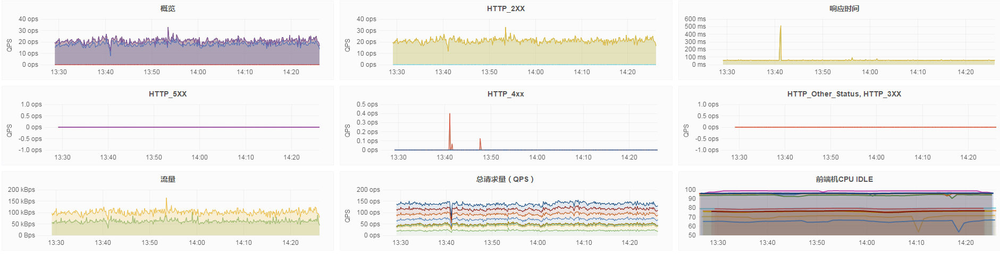
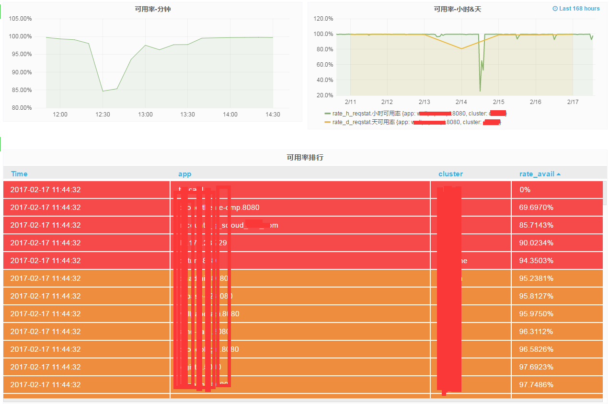

# 基于http_reqstat和influxdb的Tengine监控方案
在[基于http_reqstat模块和zabbix的Tengine监控方法](http://www.annhe.net/article-3520.html)中，使用http_reqstat模块作为数据源，经过脚本计算之后插入zabbix做监控及报警。本文将基于influxdb改进监控，并利用时序数据库丰富的功能发掘http_reqstat数据的各种用途。

## 数据采集
由于influxdb有求导数的函数，可以直接将http_reqstat的原始数据插入influxdb，不需要像用zabbix那样先算好。使用telegraf，代码详见[Github](https://github.com/annProg/influxdb_tengine_reqstat)。

## 数据展示
使用Grafana

### 模板变量
- cluster `SHOW TAG VALUES FROM "reqstat" WITH KEY = "cluster"`
- router `SHOW TAG VALUES FROM "reqstat" WITH KEY = "server" WHERE cluster =~ /^$cluster/`
- app `SHOW TAG VALUES FROM "reqstat" WITH KEY = "app" WHERE server =~ /$router/`

### 查询语句
使用`non_negative_derivative`，例如2xx状态码的qps：

`SELECT non_negative_derivative("http_2xx", 1s) AS "http_2xx" FROM "reqstat" WHERE "app" =~ /^$app$/ AND "cluster" =~ /^$cluster$/ AND "server" =~ /^$router$/ AND $timeFilter GROUP BY "cluster", "server", "app"`

响应时间的处理特殊一些：

`SELECT difference("rt") /difference("req_total") AS "rt", difference("ups_rt") /difference("ups_req") AS "ups_rt" FROM "reqstat" WHERE "app" =~ /^$app$/ AND "cluster" =~ /^$cluster$/ AND "server" =~ /^$router$/ AND $timeFilter GROUP BY "cluster", "server", "app"`

### 效果


## 扩展应用

### 趋势数据

```
> show continuous queries;
name: tengine
-------------
name		query
trend365	CREATE CONTINUOUS QUERY trend365 ON tengine BEGIN SELECT mean(req_total) AS req_total, mean(http_2xx) AS http_2xx, mean(http_3xx) AS http_3xx, mean(http_4xx) AS http_4xx, mean(http_5xx) AS http_5xx, mean(rt) AS rt, mean(conn_total) AS conn_total, mean(http_200) AS http_200, mean(http_500) AS http_500, mean(http_502) AS http_502, mean(http_503) AS http_503, mean(http_504) AS http_504, mean(http_499) AS http_499 INTO tengine.trend_365.trend365_reqstat FROM tengine."default".reqstat GROUP BY time(30m), cluster, server, app END
```

Grafana中查询方式不变

### 可用率统计
```
> show continuous queries;
name: tengine
-------------
name		query
qps		CREATE CONTINUOUS QUERY qps ON tengine BEGIN SELECT non_negative_derivative(last(bytes_in), 1s) AS bytes_in, non_negative_derivative(last(bytes_out), 1s) AS bytes_out, non_negative_derivative(last(conn_total), 1s) AS conn_total, non_negative_derivative(last(http_200), 1s) AS http_200, non_negative_derivative(last(http_206), 1s) AS http_206, non_negative_derivative(last(http_2xx), 1s) AS http_2xx, non_negative_derivative(last(http_302), 1s) AS http_302, non_negative_derivative(last(http_304), 1s) AS http_304, non_negative_derivative(last(http_3xx), 1s) AS http_3xx, non_negative_derivative(last(http_403), 1s) AS http_403, non_negative_derivative(last(http_404), 1s) AS http_404, non_negative_derivative(last(http_416), 1s) AS http_416, non_negative_derivative(last(http_499), 1s) AS http_499, non_negative_derivative(last(http_4xx), 1s) AS http_4xx, non_negative_derivative(last(http_500), 1s) AS http_500, non_negative_derivative(last(http_502), 1s) AS http_502, non_negative_derivative(last(http_503), 1s) AS http_503, non_negative_derivative(last(http_504), 1s) AS http_504, non_negative_derivative(last(http_508), 1s) AS http_508, non_negative_derivative(last(http_5xx), 1s) AS http_5xx, non_negative_derivative(last(http_other_detail_status), 1s) AS http_other_detail_status, non_negative_derivative(last(http_other_status), 1s) AS http_other_status, non_negative_derivative(last(http_ups_4xx), 1s) AS http_ups_4xx, non_negative_derivative(last(http_ups_5xx), 1s) AS http_ups_5xx, non_negative_derivative(last(req_total), 1s) AS req_total, difference(last(rt)) / difference(last(req_total)) AS rt, non_negative_derivative(last(ups_req), 1s) AS ups_req, difference(last(ups_rt)) / difference(last(ups_req)) AS ups_rt, non_negative_derivative(last(ups_tries), 1s) AS ups_tries INTO tengine."default".qps_reqstat FROM tengine."default".reqstat GROUP BY time(10m), cluster, server, app END
rate_h		CREATE CONTINUOUS QUERY rate_h ON tengine BEGIN SELECT sum(http_2xx) / sum(req_total) AS rate_2xx, sum(http_4xx) / sum(req_total) AS rate_4xx, sum(http_5xx) / sum(req_total) AS rate_5xx, sum(http_3xx) / sum(req_total) AS rate_3xx, sum(http_499) / sum(req_total) AS rate_499, sum(http_404) / sum(req_total) AS rate_404, sum(http_500) / sum(req_total) AS rate_500, sum(http_502) / sum(req_total) AS rate_502, sum(http_503) / sum(req_total) AS rate_503, sum(http_504) / sum(req_total) AS rate_504 INTO tengine.trend_365.rate_h_reqstat FROM tengine."default".qps_reqstat WHERE (http_2xx + http_3xx + http_4xx + http_5xx) <= req_total GROUP BY time(1h), cluster, app END
rate_d		CREATE CONTINUOUS QUERY rate_d ON tengine BEGIN SELECT sum(http_2xx) / sum(req_total) AS rate_2xx, sum(http_4xx) / sum(req_total) AS rate_4xx, sum(http_5xx) / sum(req_total) AS rate_5xx, sum(http_3xx) / sum(req_total) AS rate_3xx, sum(http_499) / sum(req_total) AS rate_499, sum(http_404) / sum(req_total) AS rate_404, sum(http_500) / sum(req_total) AS rate_500, sum(http_502) / sum(req_total) AS rate_502, sum(http_503) / sum(req_total) AS rate_503, sum(http_504) / sum(req_total) AS rate_504 INTO tengine.trend_365.rate_d_reqstat FROM tengine."default".qps_reqstat WHERE (http_2xx + http_3xx + http_4xx + http_5xx) <= req_total GROUP BY time(1d, -8h), cluster, app END
```

注意`rate_d`的`GROUP BY time(1d, -8h),`，influxdb使用的是UTC时间，东8区需要提前8小时执行cq。

查询分钟可用率:

```
SELECT 1 - sum("http_5xx") / sum("req_total") - sum("http_499") / sum("req_total") FROM "qps_reqstat" WHERE "cluster" =~ /^$cluster$/ AND "http_2xx" <= "req_total" AND "app" =~ /^$app$/ AND $timeFilter GROUP BY time(5m),"app", "cluster"
```

查询小时及天可用率:
```
SELECT 1 - "rate_5xx" - "rate_499" AS "小时可用率" FROM "trend_365"."rate_h_reqstat" WHERE "cluster" =~ /^$cluster$/ AND "app" =~ /^$app$/ AND $timeFilter GROUP BY  "app", "cluster"
SELECT 1 - "rate_5xx" - "rate_499" AS "天可用率" FROM "trend_365"."rate_d_reqstat" WHERE "cluster" =~ /^$cluster$/  AND "app" =~ /^$app$/ AND $timeFilter GROUP BY "app", "cluster"
```

Grafana报表展示



-----------
用influxdb数据源计算可用率可能会出现负值，可能因为网络等原因导致数据插入influxdb有延迟，出现req_total小于其他状态码qps的情况。目前只能在查询时限制条件去除这样的数据。基于日志处理的方式或许能更好的处理这种场景的需求。

## 报警
理论上可以用kapacitor来做，但是没有zabbix触发器那么直观。目前还没做。继续用zabbix的报警。