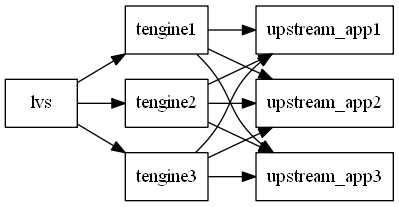
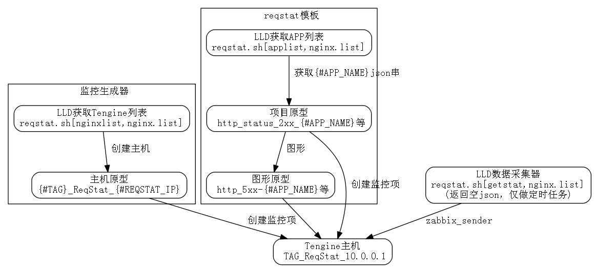

# 基于http_reqstat模块和zabbix的Tengine监控方法

Tengine的http_reqstat_module提供了监控Tengine运行状态的方法，能根据自定义变量（req_status_zone）分别统计Tengine的运行状况（域名，URI等）。本文记录了一种使用http_reqstat模块作为数据源，zabbix作为数据存储及展示，grafana作为前端展示的Tengine监控方案。
本文使用的Tengine版本为2.1.1，zabbix版本为3.0， grafana版本为2.6。

## 业务结构和数据定义

reqsat能根据不同的变量来统计Tengine状态，因此首先要根据业务需求确定需要统计的项目。本文接触的业务使用多台Tengine做反向代理，每个APP有自己独享的upstream，有一个或多个Location，但不一定使用不同的域名。



使用URI作为自定义变量会导致统计项过多（考虑404的URI），使用域名又不能很好的区分APP。因此使用upstream名称作为自定义变量是最好的选择。

```
http {
	req_status_zone app "$proxy_host" 2M;
	req_status app;
	
	server {
		listen 8000;
		location /reqstat {
			req_status_show;
			allow 10.0.0.0/8;
			allow 127.0.0.0/8;
			deny all;
		}
	}
}
```

访问 /reqstat，数据形式如下：

```
app1,210,297,1,1,1,0,0,0,0,42,1,42,1,1,0,0,0,0,0,0,0,0,0,0,0,0,0,0,0
app2,257,2593,1,1,1,0,0,0,0,74,1,74,1,1,0,0,0,0,0,0,0,0,0,0,0,0,0,0,0
```

数据含义：

```
# 每行的默认格式
kv,bytes_in,bytes_out,conn_total,req_total,http_2xx,http_3xx,http_4xx,http_5xx,http_other_status,rt,ups_req,ups_rt,ups_tries,http_200,http_206,http_302,http_304,http_403,http_404,http_416,http_499,http_500,http_502,http_503,http_504,http_508,http_other_detail_status,http_ups_4xx,http_ups_5xx

# 说明
kv 计算得到的reqstatuszone指令定义变量的值，最大长度可配置，默认104B，超长的部分截断
bytes_in 从客户端接收流量总和
bytes_out 发送到客户端流量总和
conn_total 处理过的连接总数
req_total 处理过的总请求数
http_2xx 2xx请求的总数
http_3xx 3xx请求的总数
http_4xx 4xx请求的总数
http_5xx 5xx请求的总数
httpotherstatus 其他请求的总数
rt rt的总数，所有reqstat记录的请求的request_time的和（单位为毫秒)
ups_req 需要访问upstream的请求总数
ups_rt 访问upstream的总rt
ups_tries upstram总访问次数
http_200 200请求的总数
http_206 206请求的总数
http_302 302请求的总数
http_304 304请求的总数
http_403 403请求的总数
http_404 404请求的总数
http_416 416请求的总数
http_499 499请求的总数
http_500 500请求的总数
http_502 502请求的总数
http_503 503请求的总数
http_504 504请求的总数
http_508 508请求的总数
httpotherdetail_status 非以上13种status code的请求总数
httpups4xx upstream返回4xx响应的请求总数
httpups5xx upstream返回5xx响应的请求总数
```

# 数据存储方案

使用zabbix 3.0做数据存储。zabbix 3.0支持主机原型，利用LLD获取Tengine列表，然后主机原型创建主机并链接reqstat定制模板。模板中使用LLD做定时任务。结构如图。



图中涉及代码片段如下：
```
function AppList()
{
        applist=""
        for ip in `cut -f2 -d',' $nginxlist`;do
                applist="$applist `curl -s "http://$ip$reqstat" |grep -v "^<" |cut -f1 -d','`"
        done

        str=""
        for id in `echo $applist |tr ' ' '\n' |sort -u`;do
                str="$str{\"{#APP_NAME}\":\"$id\"},"
        done
        undefine='{"{#APP_NAME}":"UNDEFINED"}'
        echo -n "{\"data\":[$str$undefine]}"
}

function NginxList()
{
        str=`awk -F ',' '{print "{\"{#TAG}\":\""$1"\",\"{#REQSTAT_IP}\":\""$2"\"},"}' $nginxlist |sort -u |sed '/^$/d' |tr -d '\n'`
        echo -n "{\"data\":[$str]}" |sed 's/,\]/\]/g'
}

case $1 in
        applist) AppList;;
        getstat) getData;;
        nginxlist) NginxList;;
        *) exit 1;;
esac
```

# 数据采集

## 数据采集流程

1. 访问/reqstat，获取统计数据
2. 一段时间后(T秒)，再次访问/reqstat，获取统计数据
3. 两次获取的数据对应项相减，得到结果 S, 数量相关的用 `S/T`，获取平均每秒的数据，响应时间相关的用 `S/T秒内请求数` 得到每个请求的平均响应时间

## 数据采集脚本

```
zabbix_server="monitor.app.cn"
datadir="data_tengine_reqstat"
extdir=$(cd `dirname $0`;pwd)
basedir="$extdir/$datadir"
[ ! -d $basedir ] && mkdir $basedir
nginxlist="$basedir/$2"
reqstat=":8000/reqstat"

tmpdir="$basedir/tmp"
[ ! -d $tmpdir ] && mkdir $tmpdir

hostkey="ReqStat"

keymap=(
kv
bytes_in
bytes_out
conn_total
req_total
http_2xx
http_3xx
http_4xx
http_5xx
http_other_status
rt
ups_req
ups_rt
ups_tries
http_200
http_206
http_302
http_304
http_403
http_404
http_416
http_499
http_500
http_502
http_503
http_504
http_508
http_other_detail_status
http_ups_4xx
http_ups_5xx
)

function getData()
{
	while read line;do
	{
		tag=`echo $line | cut -f1 -d','`
		ip=`echo $line | cut -f2 -d','`
		log="$tmpdir/push.$ip.log"
		file_start="$tmpdir/$ip.start"
		file_end="$tmpdir/$ip.end"
		file_push="$tmpdir/$ip.push"
		timedate=`date +%Y%m%d%H%M%S`
		
		host="${tag}_${hostkey}_${ip}"
		
		# 判断start file修改时间，如果大于90s，则认为监控不工作，需重新生成file_start
		modtime=`stat -c %Y $file_start`
		nowtime=`date +%s`
		value=`echo "$modtime $nowtime" |awk '{print $2-$1}'`
		[ $value -gt 90 ] && rm -f $file_start
		
		if [ ! -f $file_start ];then
			curl -s "http://$ip$reqstat" |sort -k1 -t',' >$file_start
			continue
		else
			curl -s "http://$ip$reqstat" |sort -k1 -t',' >$file_end
		fi
	
		# 根据文件修改时间计算平均值
		start_time=`stat -c %Y $file_start`
		end_time=`stat -c %Y $file_end`
		interval=`echo "$start_time $end_time" | awk '{print $2-$1}'`
		[ $interval -eq 0 ] && continue
		
		# ($a-$(a-29)+interval-1)/interval  (A+B-1)/B 向上取整, (已废弃，使用浮点数)
		# 当错误数小于interval时，计算结果为0，故向上取整，使其值至少为1，以便于反映问题
		join -t',' $file_start $file_end |\
		awk -F ',' -v host=$host -v interval=$interval -v key="${keymap[*]}" -M '{split(key,arr,/ /)}{
			for(a=31;a<60;a++){
				if($1==""){
					app="UNDEFINED"
				}else{
					app=$1
				}
				if(arr[a-29]=="rt"){
					if($(a-6)-$(a-29-6)==0){
						continue
					}
					print host" "arr[a-29]"["app"] "($a-$(a-29))/($(a-6)-$(a-29-6))
				}else if(arr[a-29]=="ups_rt"){
					if($(a-1)-$(a-29-1)==0){
						continue
					}
					print host" "arr[a-29]"["app"] "($a-$(a-29))/($(a-1)-$(a-29-1))
				}else{
					print host" "arr[a-29]"["app"] "($a-$(a-29))/interval
				}}}' >$file_push
		if [ $(id -u) != 0 ];then
			logtime=`date +%Y%m%d%H%M%S`
			echo $logtime >>$log
			zabbix_sender -z $zabbix_server -i $file_push &>>$log
			echo "$interval" >>$log
			cp -f $file_end $file_start
		else
			echo "$value $interval"
		fi
		#mv $file_start $file_start.$timedate
		#mv $file_end $file_end.$timedate
	} &
	done <$nginxlist
	wait
	echo '{"data":[]}'

}

```


# zabbix配置

# grafana配置

# 报表数据搜集