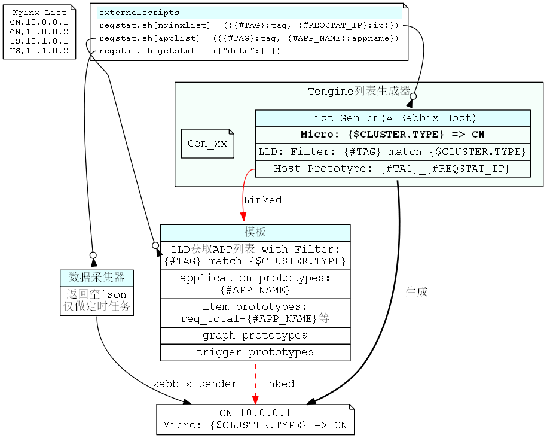
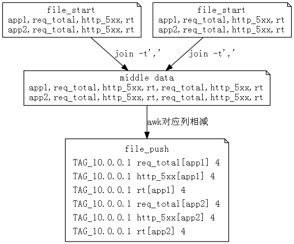

# 基于http_reqstat模块和zabbix的Tengine监控方法

Tengine的http_reqstat_module提供了监控Tengine运行状态的方法，能根据自定义变量（req_status_zone）统计Tengine的运行状况（域名，URI等）。本文记录了一种使用http_reqstat模块作为数据源，zabbix作为数据存储及展示，grafana作为前端展示的Tengine监控方案。
本文使用的Tengine版本为2.1.1，zabbix版本为3.0， grafana版本为2.6。

## Tengine reqstat数据形式

### 业务结构
reqsat能根据不同的Nginx变量来统计状态信息（例如统计每个域名，或者统计每个URI），因此首先要根据业务需求确定需要统计的变量。本文接触的业务分属于不同的集群，每个集群使用多台Tengine做反向代理，每个APP有自己独享的upstream，有一个或多个Location，但不一定使用相同的域名。


### Tengine配置
使用URI作为自定义变量会导致统计项过多（考虑404的URI），使用域名又不能很好的区分APP。因此使用upstream名称作为自定义变量是最好的选择。

```
http {
	req_status_zone app "$proxy_host" 2M;
	req_status app;
	
	server {
		listen 9009;
		location /reqstat {
			req_status_show;
			allow 10.0.0.0/8;
			allow 127.0.0.0/8;
			deny all;
		}
	}
}
```

### reqstat数据形式
访问 /reqstat，数据形式如下：

```
app1,210,297,1,1,1,0,0,0,0,42,1,42,1,1,0,0,0,0,0,0,0,0,0,0,0,0,0,0,0
app2,257,2593,1,1,1,0,0,0,0,74,1,74,1,1,0,0,0,0,0,0,0,0,0,0,0,0,0,0,0
```

数据含义：

```
# 每行的默认格式
kv,bytes_in,bytes_out,conn_total,req_total,http_2xx,http_3xx,http_4xx,http_5xx,http_other_status,rt,ups_req,ups_rt,ups_tries,http_200,http_206,http_302,http_304,http_403,http_404,http_416,http_499,http_500,http_502,http_503,http_504,http_508,http_other_detail_status,http_ups_4xx,http_ups_5xx

# 说明
kv 计算得到的reqstatuszone指令定义变量的值，最大长度可配置，默认104B，超长的部分截断
bytes_in 从客户端接收流量总和
bytes_out 发送到客户端流量总和
conn_total 处理过的连接总数
req_total 处理过的总请求数
http_2xx 2xx请求的总数
http_3xx 3xx请求的总数
http_4xx 4xx请求的总数
http_5xx 5xx请求的总数
httpotherstatus 其他请求的总数
rt rt的总数，所有reqstat记录的请求的request_time的和（单位为毫秒)
ups_req 需要访问upstream的请求总数
ups_rt 访问upstream的总rt
ups_tries upstram总访问次数
http_200 200请求的总数
http_206 206请求的总数
http_302 302请求的总数
http_304 304请求的总数
http_403 403请求的总数
http_404 404请求的总数
http_416 416请求的总数
http_499 499请求的总数
http_500 500请求的总数
http_502 502请求的总数
http_503 503请求的总数
http_504 504请求的总数
http_508 508请求的总数
httpotherdetail_status 非以上13种status code的请求总数
httpups4xx upstream返回4xx响应的请求总数
httpups5xx upstream返回5xx响应的请求总数
```

## 数据存储方案
### 物理结构与zabbix的对应关系
使用zabbix存储监控数据，物理结构对应zabbix组织形式如图：


本文使用zabbix LLD的host prototype功能自动生成主机，zabbix 3之后有了application prototype功能，这样item prototype里可以设置item所属的application prototype。因此可以实现上图中 `APP upstream名称` 和 `zabbix application` 的对应关系。

### 监控项单位
监控的项目大致分为3类：

* request 请求数量，包含总请求量，各http_status请求量等，期望存储单位 request/秒 
* request time 请求时间，期望存储单位 rt/请求
* byte 流量，存储单位 B/秒

### 监控结构图

监控的大致流程为：

1. 新建模板，添加LLD用于获取包含TAG的APP_NAME列表，并设置Filter：{#TAG} match {$CLUSTER.TYPE}
1. 新建一个HOST作为列表生成器，并设置主机宏：{$CLUSTER.TYPE} => TAG
2. 为列表生成器添加LLD，用于获取包含TAG的Tengine IP列表，并设置Filter：{#TAG} match {$CLUSTER.TYPE}
3. 为列表生成器添加Host Prototype，使用 {#TAG}_{#REQSTAT_IP}作为NAME
2. 基于步骤3、4， 一个列表生成器的Host Prototype只取TAG和主机宏设置的TAG相同的Tengine IP生成HOST并链接模板，新生成的HOST会继承列表生成器的宏变量{$CLUSTER.TYPE}。**因此有多个集群需要监控时，需要建立多个列表生成器**
4. HOST链接模板，基于步骤1、5，当HOST的{$CLUSTER.TYPE}和模板LLD返回的APP_NAME的TAG一致时，才会使用此APP_NAME创建item，application等
5. 数据采集LLD发送数据到zabbix

如图所示：



## 监控实现

本文需要建立一个zabbix模板，添加列表生成器主机和采集器主机，并实现相关控制脚本（即上节图中 reqstat.sh）。

### zabbix设置

根据上节图形及描述，以集群名称CN为例，zabbix配置步骤如下：

1. 准备nginx ip列表文件: nginx.list
1. 新建模板 Tengine_reqstat
2. 为模板添加LLD: app列表，设置key: reqstat.sh[applist], 并添加Filter: {#TAG} match {$CLUSTER.TYPE}
3. 为模板LLD添加item prototypes，以{#APP_NAME}为参数，例如 http_200[{#APP_NAME}]。数据类型为 Numberic(float)，Application Prototype使用宏{#APP_NAME}
4. 模板LLD中按需添加Graph Prototypes和Trigger Prototypes
3. 新建列表生成器HOST，设置主机宏: {$CLUSTER.TYPE} => CN
4. 为列表生成器添加LLD，设置key: reqstat.sh[nginxlist], 并添加Filter: {#TAG} match {$CLUSTER.TYPE}
5. 为列表生成器LLD添加Host Prototype，NAME为 {#TAG}_{#REQSTAT_IP}， 并链接模板 Tengine_reqstat
6. 新建采集器HOST，添加LLD，设置key: reqstat.sh[getstat]
7. 如果集群新增机器，编辑nginx.list，添加新机器
8. 如果新增集群，编辑nginx.list，添加新集群IP，并重复步骤 6,7,8（可以通过Clone Host简化）


### 监控脚本

#### Tengine列表
列表文件格式为 TAG,IP形式，TAG主要用来标记集群名称。

```
function NginxList()
{
        str=`awk -F ',' '{print "{\"{#TAG}\":\""$1"\",\"{#REQSTAT_IP}\":\""$2"\"},"}' $nginxlist |sort -u |sed '/^$/d' |tr -d '\n'`
        echo -n "{\"data\":[$str]}" |sed 's/,\]/\]/g'
}
```

#### app列表
获取带有TAG的APP列表：

```
function AppList()
{
	applist=""
	while read item;do
		ip=`echo $item |cut -f2 -d','`
		tag=`echo $item |cut -f1 -d','`
		applist="$applist `curl -s "http://$ip$reqstat" |grep -v "^<" |awk -v t=$tag -F ',' '{print t","$1}'`"
	done <$nginxlist

	str=""
	for id in `echo $applist |tr ' ' '\n' |sort -u`;do
		appname=`echo $id |cut -f2 -d','`
		[ "$appname"x == ""x ] && appname=UNDEFINED
		tag=`echo $id |cut -f1 -d','`
		str="$str{\"{#APP_NAME}\":\"$appname\",\"{#TAG}\":\"$tag\"},"
	done
	echo -n "{\"data\":[$str]}" |sed 's/\},\]\}/\}\]\}/g'
}
```

#### 数据采集器

##### 数据采集流程

1. 访问/reqstat，获取统计数据
2. 一段时间后(T秒)，再次访问/reqstat，获取统计数据
3. 两次获取的数据对应项相减，得到结果 S, 数量相关的用 `S/T`，获取平均每秒的数据，响应时间相关的用 `S/T秒内请求数` 得到每个请求的平均响应时间

具体实现中，第一次访问获取的数据保存为 file_start, 第二次访问获取的数据保存为 file_end，然后对2个文件执行 join操作，然后对应列相减，获得需要的数据。
核心代码是一段awk脚本：

```
join -t',' $file_start $file_end |\
awk -F ',' -v host=$host -v interval=$interval -v key="${keymap[*]}" -M '{split(key,arr,/ /)}{
	for(a=31;a<60;a++){
		if($1==""){
			app="UNDEFINED"
		}else{
			app=$1
		}
		if(arr[a-29]=="rt"){
			if($(a-6)-$(a-29-6)==0){
				continue
			}
			print host" "arr[a-29]"["app"] "($a-$(a-29))/($(a-6)-$(a-29-6))
		}else if(arr[a-29]=="ups_rt"){
			if($(a-1)-$(a-29-1)==0){
				continue
			}
			print host" "arr[a-29]"["app"] "($a-$(a-29))/($(a-1)-$(a-29-1))
		}else{
			print host" "arr[a-29]"["app"] "($a-$(a-29))/interval
		}}}' >$file_push
```

上面代码干的事情(简化)如图所示：



file_push的形式正好是zabbix_sender要求的格式，直接 `zabbix_sender -z $zabbix_server -i file_push` 就可以提交数据。

awk参数中有个 `-M`，这个参数是为了计算大数，需要编译MPFR：

```
[root@op.ct.114.scloud externalscripts]# awk --version
GNU Awk 4.1.3, API: 1.1 (GNU MPFR 2.4.1, GNU MP 4.3.1)
Copyright (C) 1989, 1991-2015 Free Software Foundation.
```

## grafana配置
使用grafana作为前端最好的特性是可以在一个screen里看到某个APP多个指标图形，另外一个好处是可以看到每个点的数据值。


## 附录

### 模板trigger示例
可以使用trigger发现出现5xx错误或者请求量异常突增突降的APP。例如下面的trigger表示最近一个qps如果是上2个的3倍以上，并且qps大于20（APP有流量），则认为这个APP请求量突增。

```
{TEMPLATE:req_total[{#APP_NAME}].last()}/({TEMPLATE:req_total[{#APP_NAME}].last(#3)}+1)>3 and {TEMPLATE:req_total[{#APP_NAME}].last()} > 20
```

### reqstat.sh完整代码

```
#!/bin/bash

zabbix_server="monit.app.cn"
datadir="data_tengine_reqstat"
extdir=$(cd `dirname $0`;pwd)
basedir="$extdir/$datadir"
[ ! -d $basedir ] && mkdir $basedir
if [ $# -eq 2 ];then
	nginxlist="$basedir/$2"
else
	nginxlist="$basedir/nginx.list"
fi
reqstat=":9009/reqstat"

tmpdir="$basedir/tmp"
[ ! -d $tmpdir ] && mkdir $tmpdir

hostkey="ReqStat"

keymap=(
kv
bytes_in
bytes_out
conn_total
req_total
http_2xx
http_3xx
http_4xx
http_5xx
http_other_status
rt
ups_req
ups_rt
ups_tries
http_200
http_206
http_302
http_304
http_403
http_404
http_416
http_499
http_500
http_502
http_503
http_504
http_508
http_other_detail_status
http_ups_4xx
http_ups_5xx
)

function getData()
{
	while read line;do
	{
		tag=`echo $line | cut -f1 -d','`
		ip=`echo $line | cut -f2 -d','`
		log="$tmpdir/push.$ip.log"
		tmpfile="$tmpdir/join.$ip.tmp"
		file_start="$tmpdir/$ip.start"
		file_end="$tmpdir/$ip.end"
		file_push="$tmpdir/$ip.push"
		timedate=`date +%Y%m%d%H%M%S`
		logvar=$timedate
		
		host="${tag}_${hostkey}_${ip}"
		
		# 判断start file修改时间，如果大于90s，则认为监控不工作，需重新生成file_start
		modtime=`stat -c %Y $file_start`
		nowtime=`date +%s`
		value=`echo "$modtime $nowtime" |awk '{print $2-$1}'`
		[ $value -gt 90 ] && rm -f $file_start
		logvar="$logvar \"$value\""
		
		if [ ! -f $file_start ];then
			curl -s "http://$ip$reqstat" |sort -k1 -t',' >$file_start
			continue
		else
			curl -s "http://$ip$reqstat" |sort -k1 -t',' >$file_end
		fi
	
		# 根据文件修改时间计算平均值
		start_time=`stat -c %Y $file_start`
		end_time=`stat -c %Y $file_end`
		interval=`echo "$start_time $end_time" | awk '{print $2-$1}'`
		logvar="$logvar \"$interval\""
		[ $interval -eq 0 ] && continue
		
		# ($a-$(a-29)+interval-1)/interval  (A+B-1)/B 向上取整, (已废弃，使用浮点数)
		# 当错误数小于interval时，计算结果为0，故向上取整，使其值至少为1，以便于反映问题
		join -t',' $file_start $file_end 2>$tmpfile |\
		awk -F ',' -v host=$host -v interval=$interval -v key="${keymap[*]}" -M '{split(key,arr,/ /)}{
			for(a=31;a<60;a++){
				if($1==""){
					app="UNDEFINED"
				}else{
					app=$1
				}
				if(arr[a-29]=="rt"){
					if($(a-6)-$(a-29-6)==0){
						continue
					}
					print host" "arr[a-29]"["app"] "($a-$(a-29))/($(a-6)-$(a-29-6))
				}else if(arr[a-29]=="ups_rt"){
					if($(a-1)-$(a-29-1)==0){
						continue
					}
					print host" "arr[a-29]"["app"] "($a-$(a-29))/($(a-1)-$(a-29-1))
				}else{
					print host" "arr[a-29]"["app"] "($a-$(a-29))/interval
				}}}' >$file_push
		joinlog=`cat $tmpfile`
		[ "$joinlog"x == ""x ] && joinlog="join SUCC"
		logvar="$logvar \"$joinlog\""

		if [ $(id -u) != 0 ];then
			echo "==========================================================" >>$log
			echo $logvar >>$log
			zabbix_sender -z $zabbix_server -i $file_push &>>$log
			cp -f $file_end $file_start
		else
			echo "$logvar"
		fi
		#mv $file_start $file_start.$timedate
		#mv $file_end $file_end.$timedate

	} done <$nginxlist
	wait
	echo '{"data":[]}'

}

function AppList()
{
	applist=""
	while read item;do
		ip=`echo $item |cut -f2 -d','`
		tag=`echo $item |cut -f1 -d','`
		applist="$applist `curl -s "http://$ip$reqstat" |grep -v "^<" |awk -v t=$tag -F ',' '{print t","$1}'`"
	done <$nginxlist

	str=""
	for id in `echo $applist |tr ' ' '\n' |sort -u`;do
		appname=`echo $id |cut -f2 -d','`
		[ "$appname"x == ""x ] && appname=UNDEFINED
		tag=`echo $id |cut -f1 -d','`
		str="$str{\"{#APP_NAME}\":\"$appname\",\"{#TAG}\":\"$tag\"},"
	done
	echo -n "{\"data\":[$str]}" |sed 's/\},\]\}/\}\]\}/g'
}

function NginxList()
{
	str=`awk -F ',' '{print "{\"{#TAG}\":\""$1"\",\"{#REQSTAT_IP}\":\""$2"\"},"}' $nginxlist |sort -u |sed '/^$/d' |tr -d '\n'`
	echo -n "{\"data\":[$str]}" |sed 's/,\]/\]/g'
}

case $1 in
	applist) AppList;;
	getstat) getData;;
	nginxlist) NginxList;;
	null) echo '{"data":[]}';;
	*) exit 1;;
esac
```

## 参考资料

```
[1]. http://tengine.taobao.org/document_cn/http_reqstat_cn.html
[2]. https://github.com/alexanderzobnin/grafana-zabbix/
[3]. https://www.zabbix.com/documentation/3.0/
```