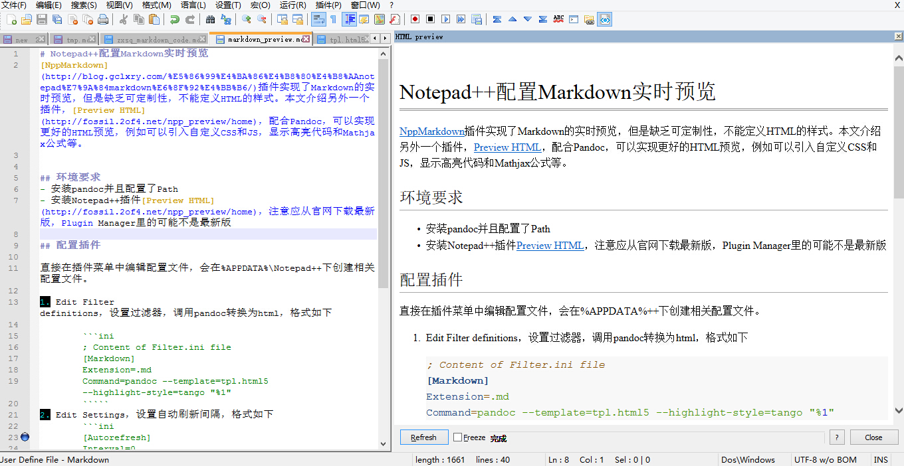

# Notepad++配置Markdown实时预览
[NppMarkdown](http://blog.gclxry.com/%E5%86%99%E4%BA%86%E4%B8%80%E4%B8%AAnotepad%E7%9A%84markdown%E6%8F%92%E4%BB%B6/)插件实现了Markdown的实时预览，但是缺乏可定制性，不能定义HTML的样式。本文介绍另外一个插件，[Preview HTML](http://fossil.2of4.net/npp_preview/home)，配合Pandoc，可以实现更好的HTML预览，例如可以引入自定义CSS和JS，显示高亮代码和$Mathjax$公式等。

## 环境要求
- 安装pandoc并且配置了Path
- 安装Notepad++插件[Preview HTML](http://fossil.2of4.net/npp_preview/home)，注意应从官网下载最新版，Plugin Manager里的可能不是最新版

## 配置插件

直接在插件菜单中编辑配置文件，会在%APPDATA%\Notepad++下创建相关配置文件。

1. Edit Filter definitions，设置过滤器，调用pandoc转换为html，格式如下

	```
	; Content of Filter.ini file
	[Markdown]
	Extension=.md
	Command=pandoc --template=tpl.html5 --highlight-style=tango --mathjax="http://cdn.bootcss.com/mathjax/2.5.3/MathJax.js?config=TeX-AMS-MML_HTMLorMML" "%1"
	`````
2. Edit Settings，设置自动刷新间隔，格式如下
	```
	[Autorefresh]
	Interval=0
	`````
	
## 展示



## 总结
1.  不足之处是pandoc处理速度毕竟不如NppMarkdown内建的解析器快，如果设置为实时刷新，写作会有些卡壳的感觉，可以考虑自动刷新间隔设置长一些
2. 预览窗口不能随着写作窗口自动滚动

## 参考资料
> 1. [How to use markdown in notepad++](http://superuser.com/questions/586177/how-to-use-markdown-in-notepad)
> 2. [Live LaTeX in Notepad++](http://csholmq.se/blog/notepadpp)

## 附录
html文件模板代码

````
<!DOCTYPE html>
<html$if(lang)$ lang="$lang$"$endif$>
<head>
  <meta charset="utf-8">
  <meta name="generator" content="pandoc">
$for(author-meta)$
  <meta name="author" content="$author-meta$">
$endfor$
$if(date-meta)$
  <meta name="dcterms.date" content="$date-meta$">
$endif$
  <title>$if(title-prefix)$$title-prefix$ - $endif$$pagetitle$</title>
  <meta name="viewport" content="width=device-width, initial-scale=1.0">
  <link href="templates/css/bootstrap-combined.min.css" rel="stylesheet">
  <style type="text/css">
  body {
    font-size:16px;
    line-height:24px;
}

.sidebar-nav-fixed {
    position:fixed;
    top:84px;
    width:16.48%;
}

@media (max-width: 767px) {
    .sidebar-nav-fixed {
        width:auto;
    }
}

@media (max-width: 979px) {
    .sidebar-nav-fixed {
        position:static;
        width:auto;
    }
}

@media (min-width: 980px) {
    .title {
        width:940px;
    }
    .container-fluid {
        width:940px;
    }
}

h1, h2, h3, h4, h5, h6 {
    color: black;
    background: none;
    font-weight: normal;
    margin: 0;
    overflow: hidden;
    padding-top: .5em;
    padding-bottom: .17em;
}

h1 {
    font-size:32px;
    border-bottom: 4px double #aaa;
}

h2 {
    font-size:24px;
    border-bottom: 1px solid #aaa;
}

h3 {
    font-size:21px;
}

h1, h2 {
    margin-bottom:.6em;
    line-height:1.1em;
}

h3, h4, h5 {
    margin-bottom:.3em;
}

img {
	border-style: solid; 
	border-width: 0px;
	width:90%;
}

#TOC > ul {
    margin:0;
}

#TOC > ul > li {
    font-size:16px;
    line-height:24px;
    list-style-type:none;
}

#TOC > ul > li > ul > li {
    font-size:16px;
    line-height:24px;
}

#TOC > ul > li > ul > li > ul {
    display:none;
    /*font-size:14px;
    line-height:20px;*/
}

blockquote > p {
    font-size:16px;
}

.table {
    width:auto;
}

sup, sub {
    line-height: 1em;
}

header {
    position:static;
    width:100%;
    overflow:visible;
    display:block;


    background-image: linear-gradient(to bottom, #ffffff, #f2f2f2);
    background-repeat: repeat-x;
    border: 1px solid #d4d4d4;
    -webkit-box-shadow: inset 0 -1px 0 rgba(0, 0, 0, 0.1), 0 1px 10px rgba(0, 0, 0, 0.1);
    -moz-box-shadow: inset 0 -1px 0 rgba(0, 0, 0, 0.1), 0 1px 10px rgba(0, 0, 0, 0.1);
    box-shadow: inset 0 -1px 0 rgba(0, 0, 0, 0.1), 0 1px 10px rgba(0, 0, 0, 0.1);
}

.title {
    color:#555555;
    border-bottom:0;
    font-size:20px;
    padding: .5em;
    margin-bottom:0;
    margin-left:auto;
    margin-right:auto;
}

nav li:focus {
    background-color:#EEEEEE;
}

nav a:hover {
    text-decoration:none;
}

.title > a {
    color:#555555;
}

.title a:hover {
    text-decoration:none;
}

.container-fluid {
    margin-left:auto;
    margin-right:auto;
    padding: 2em 0 4em 0;
}
  </style>
  <style type="text/css">code{white-space: pre;}</style>
  <!--[if lt IE 9]>
    <script src="http://html5shim.googlecode.com/svn/trunk/html5.js"></script>
  <![endif]-->
$if(quotes)$
  <style type="text/css">q { quotes: "“" "”" "‘" "’"; }</style>
$endif$
$if(highlighting-css)$
  <style type="text/css">
$highlighting-css$
  </style>
$endif$
$for(css)$
  <link rel="stylesheet" href="$css$">
$endfor$
$if(math)$
  $math$
$endif$
$for(header-includes)$
  $header-includes$
$endfor$
</head>
<body>
$for(include-before)$
$include-before$
$endfor$
<!-- doc title / page header -->
$if(title)$
<header>
<h1 class="title">$title$</h1>
$for(author)$
<!--<h2 class="author">$author$</h2>-->
$endfor$
$if(date)$
<!--<h3 class="date">$date$</h3>-->
$endif$
</header>
$endif$
<div class="container-fluid">
<div class="row-fluid">
$if(toc)$
<div class="span4">
<nav id="$idprefix$TOC" class="sidebar-nav sidebar-nav-fixed">
$toc$
</nav>
</div>
$endif$
<div class="span8">
$body$
<hr>
$for(include-after)$
$include-after$
$endfor$
</div><!--/row-->
</div><!--/container-->
</body>
</html>
``````